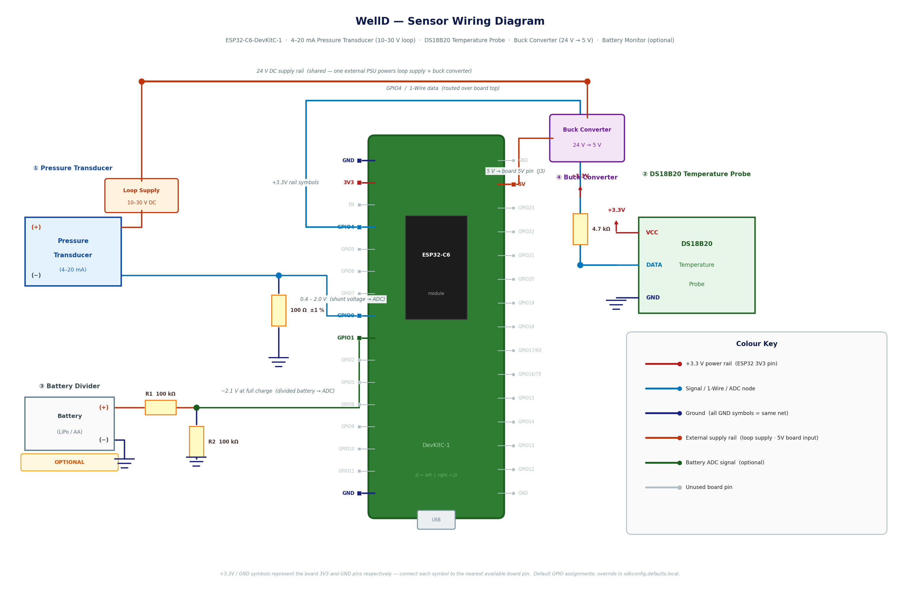

# WellD — Wiring Guide

This guide walks you through connecting the three sensors to an ESP32-C6 development board. No electronics experience is assumed. Read the whole guide before touching any wires.



> **Scope note (2026-07-05):** this guide and the diagram above cover the **dev-board build only**. On the custom PCB (see the [README](../README.md) and [`hardware/pcb/`](../hardware/pcb/)) none of this hand-wiring applies — the board implements these circuits on-board, and the 2026-07-05 PCB review changed several of them: the battery divider is now switched on the **high side by a Q5 P-FET** (driven via Q2 from GPIO15), the 12 V VLOOP boost gained a **D15 Schottky rectifier and a Q3/Q4 load-disconnect switch** (GPIO5 gates both, with a 10 ms rail-settle wait), and the **status LED moved to GPIO14** (GPIO13 is reserved for the factory-reset strap). The diagram is generated by `gen_wiring_diagram.py`, which draws only the dev-board breadboard wiring — it contains none of the changed PCB elements, so it does not need regenerating for this change; if the diagram is ever extended to cover the custom PCB, `gen_wiring_diagram.py` must be updated and rerun first.

---

## What you will need

| Item | What it looks like / where to get one |
|---|---|
| ESP32-C6 development board | A small green circuit board with the chip in the centre and a USB port on one end. Any board with the ESP32-C6 chip works. |
| 4–20 mA submersible pressure transducer | A waterproof stainless steel cylinder on a cable, rated 0–6 m. Has two wires (+ and −) coming out of the top. |
| 100 Ω resistor, ±1 % tolerance | A small component with colour bands. Bands: brown–black–brown–brown for 100 Ω ±1 %. Available from any electronics supplier. |
| DS18B20 waterproof temperature probe | A small stainless steel probe on three wires (red, black, yellow/white). |
| 4.7 kΩ resistor | Bands: yellow–violet–red–gold for 4.7 kΩ ±5 %, or yellow–violet–black–brown–brown for ±1 %. |
| Breadboard or terminal blocks | A breadboard lets you push wires in without soldering. Terminal blocks are better for permanent installs. |
| Jumper wires | Short wires for connecting things on a breadboard. |
| Multimeter (recommended) | Used to verify voltages before connecting the ESP32. Any cheap multimeter will do. |

---

## Safety first

- The **ESP32-C6** runs on **3.3 V** logic. Do not apply more than 3.3 V to its GPIO or ADC pins — higher voltages will permanently damage the chip.
- The pressure transducer may require a separate power supply of **9–36 V** depending on the model. This higher voltage never connects to the ESP32 directly — only a tiny voltage across a 100 Ω resistor does.
- Double-check every connection with a multimeter before powering on the ESP32.

---

## Understanding the ESP32-C6 pins

The ESP32-C6 has labelled pins along both edges of the board. The labels you care about are:

- **GPIO0 through GPIO6** — these are the analog measurement pins (called ADC1 channels 0–6 internally). You can measure voltages on them.
- **GPIO4** — this is also the default pin for the DS18B20 temperature probe. It does a different job (digital communication), so it cannot be used as a measurement pin at the same time.
- **3V3** (or **3.3V**) — the board's regulated 3.3 V power output. Used to power sensors.
- **GND** — ground / negative. Every sensor shares this.

The table below shows which GPIO pin corresponds to which measurement channel:

| ADC1 channel number | Physical pin label | Default use |
|---|---|---|
| 0 | GPIO0 | Pressure transducer ← use this |
| 1 | GPIO1 | Battery voltage (if wired) |
| 2 | GPIO2 | Spare |
| 3 | GPIO3 | Spare |
| 4 | GPIO4 | **Used for DS18B20 data — do not also use for ADC** |
| 5 | GPIO5 | Spare |
| 6 | GPIO6 | Spare |

> Throughout this guide the examples use **GPIO0** for the transducer and **GPIO4** for the DS18B20. The firmware Kconfig default is **GPIO7** (custom PCB). Dev-board users should add `CONFIG_WELLD_DS18B20_GPIO=4` to their `sdkconfig.defaults.local` to match this guide.

---

## Part 1 — Pressure transducer (water level)

### What this sensor does

The transducer sits submerged in your well. Water pressure pushes on its membrane and it responds by drawing between 4 milliamps (at zero depth) and 20 milliamps (at full depth) of current. The firmware measures that current and converts it to metres.

### What the 100 Ω resistor does

The ESP32-C6 cannot measure current directly — it measures voltage. Placing a 100 Ω resistor in series with the sensor's return wire converts the 4–20 mA signal to a 0.4–2.0 V signal that the ADC can read safely.

```
4 mA  × 100 Ω = 0.40 V  →  0 metres  (empty reading)
20 mA × 100 Ω = 2.00 V  →  6 metres  (full reading)
```

### Step-by-step wiring

Your transducer has two wires: **positive (+)** and **negative (−)**. Usually red is + and black is −, but check the label on the cable or the datasheet.

**Step 1 — Power the transducer.**

Connect the transducer's **+** wire to your loop power supply. Most 4–20 mA submersible sensors need **9–36 V** to work — check the datasheet for your specific model. If your sensor specifically states it works at 3.3 V or 5 V, you can use the board's **3V3** pin. Do not assume 3.3 V is enough without checking.

**Step 2 — Wire the shunt resistor.**

The 100 Ω resistor goes between the transducer's **−** wire and **GND**. One leg of the resistor connects to the transducer − wire; the other leg connects to GND.

**Step 3 — Connect the ADC pin.**

Connect **GPIO0** to the junction between the transducer − wire and the top leg of the 100 Ω resistor. This is the point where the voltage measurement happens.

The finished circuit looks like this:

```
  [Loop supply +] ────── Transducer (+)    ← power from your supply
                         Transducer (−) ───┬──── GPIO0  ← ADC reads here
                                           │
                                        100 Ω            ← shunt resistor
                                           │
                                          GND
```

**Before connecting the ESP32**, use a multimeter set to DC voltage and measure the voltage between GPIO0 and GND:
- With the transducer submerged at zero depth: you should see approximately **0.40 V**
- At full depth (or pressing the membrane hard with your finger): closer to **2.00 V**
- If the transducer is disconnected or unpowered: near **0 V**

A reading near 0 V with a powered transducer means an open circuit — check all connections.

### What if my transducer needs a different shunt resistor?

The 100 Ω default works for most sensors. If you need a different value, update `CONFIG_WELLD_SENSOR_SHUNT_MILLIOHMS` in your `sdkconfig.defaults.local` file. The value is in **milliohms** — so 100 Ω = `100000`, 50 Ω = `50000`, etc.

Keep the resistor value low enough that 20 mA × resistance ≤ 3.1 V. At 150 Ω, 20 mA would produce 3.0 V which is close to the limit — 100 Ω is the safe default.

---

## Part 2 — DS18B20 temperature probe

### What this sensor does

The DS18B20 is a digital thermometer in a waterproof stainless steel probe. Lower it alongside the pressure transducer to measure water temperature. It communicates over a single data wire using a protocol called 1-Wire.

### Step-by-step wiring

The DS18B20 probe has **three wires**:

| Wire colour | Name | Where it connects |
|---|---|---|
| Red | VCC (power) | 3V3 on the ESP32-C6 |
| Black | GND | GND on the ESP32-C6 |
| Yellow or White | DATA (signal) | GPIO4, **and** through a 4.7 kΩ resistor to 3V3 |

The 4.7 kΩ pull-up resistor is mandatory — the 1-Wire protocol relies on the data line sitting at 3.3 V when idle, and both the sensor and the ESP32 communicate by pulling it temporarily low. Without the resistor, communication fails.

**Step 1 — Connect power and ground.**

- Red wire → **3V3** pin
- Black wire → **GND** pin

**Step 2 — Connect the data wire with its pull-up resistor.**

- Yellow/white wire → **GPIO4**
- One leg of the **4.7 kΩ resistor** → **GPIO4** (same point as the data wire)
- Other leg of the **4.7 kΩ resistor** → **3V3**

The circuit looks like this:

```
  3V3 ───┬────────── Red wire (VCC)
         │
       4.7 kΩ          ← pull-up resistor
         │
  GPIO4 ─┴────────── Yellow/white wire (DATA)

  GND  ──────────── Black wire (GND)
```

**Checking the connection** (before powering the ESP32): With just power and ground connected (no data yet), the DS18B20 should draw only a fraction of a milliamp. If you measure 3.3 V between the data wire and GND before attaching GPIO4, the pull-up resistor is wired correctly.

### Placement

Lower the DS18B20 alongside the pressure transducer cable, sealed against water ingress. The stainless probe is rated for continuous submersion. Coil any excess cable loosely — avoid sharp bends near the probe head.

---

## Part 3 — Battery voltage monitoring (optional)

Skip this section if you do not want to track battery level in Home Assistant. The firmware works fine without it.

### Why you cannot measure battery voltage directly

A LiPo cell is 4.2 V at full charge. The ESP32-C6 ADC pins cannot safely measure more than 3.1 V. Connecting 4.2 V to a GPIO pin would damage the chip.

A voltage divider — two resistors in series from battery positive to GND — scales the voltage down to something the ADC can safely read.

### How a voltage divider works

```
  Battery (+) ──── R1 ──┬──── GPIO1  (ADC reads here)
                        │
                        R2
                        │
                       GND
```

The voltage at the middle point (where GPIO1 connects) is:

```
V_adc = V_battery × R2 / (R1 + R2)
```

The firmware then reverses this calculation to recover the battery voltage.

### Choosing resistor values

Use **equal resistors** for simplicity. Two 100 kΩ resistors give a 2:1 divider that halves the battery voltage:

```
V_adc = 4.2 V × 100 kΩ / (100 kΩ + 100 kΩ) = 2.1 V   ← safely under 3.1 V
```

Use high-resistance values (100 kΩ or higher) to keep the current through the divider tiny — at 100 kΩ + 100 kΩ the divider draws only 20 µA from the battery, which is negligible.

### Step-by-step wiring for a LiPo / 18650 cell

**Step 1 — Wire the resistors.**

- Connect one leg of **R1 (100 kΩ)** to **Battery (+)**.
- Connect the other leg of **R1** to one leg of **R2 (100 kΩ)**.
- Connect the remaining leg of **R2** to **GND**.

**Step 2 — Connect the ADC pin.**

- Connect **GPIO1** to the junction between R1 and R2.

**Step 3 — Verify before connecting.**

With a multimeter, measure the voltage at GPIO1. At full LiPo charge (4.2 V battery) you should see approximately **2.1 V** at GPIO1. It must not exceed **3.1 V**.

The circuit:

```
  Battery (+) ──── 100 kΩ (R1) ──┬──── GPIO1
                                  │
                             100 kΩ (R2)
                                  │
                                 GND
```

### Resistor values for other battery types

| Battery type | Full voltage | R1 | R2 | V at GPIO at full charge |
|---|---|---|---|---|
| LiPo / Li-ion | 4.2 V | 100 kΩ | 100 kΩ | 2.1 V |
| 3× AA alkaline | 4.5 V | 220 kΩ | 100 kΩ | 1.4 V |
| 2× AA alkaline | 3.0 V | 100 kΩ | 100 kΩ | 1.5 V |

For 2× AA cells, keep the same two-resistor divider (`CONFIG_WELLD_BATT_DIVIDER_RATIO=200`). The firmware does not accept a direct connection: the Kconfig minimum for `WELLD_BATT_DIVIDER_RATIO` is 136 (a 1.36:1 divider), which guards the ADC pin against over-voltage on higher-voltage packs.

---

## Complete wiring diagram

All three sensors connected at once, using default pin assignments and a LiPo battery on GPIO1:

```
  3V3 ────┬──────────────────────────── DS18B20 VCC (red)
          │
        4.7 kΩ   (pull-up)
          │
  GPIO4 ──┴──────────────────────────── DS18B20 DATA (yellow)

  GND  ──────────────────────────────── DS18B20 GND (black)


  [Loop supply] ─── Transducer (+)
  GPIO0 ─────────┬─ Transducer (−)
                 │
               100 Ω   (shunt)
                 │
  GND  ──────────┘


  Battery (+) ─── 100 kΩ ─┬─── GPIO1
                           │
                        100 kΩ
                           │
  GND  ──────────────────── ┘

  Battery (+) ────────────────────── [Regulator] ── 3V3 rail
```

---

## Setting the firmware configuration

After wiring, open your local config file and make sure these values match your hardware. If you followed this guide with the default pins, the values below are already correct.

```bash
cp sdkconfig.defaults.local.example sdkconfig.defaults.local
```

Then edit `sdkconfig.defaults.local`:

```ini
# Pressure transducer
CONFIG_WELLD_SENSOR_ADC_CHANNEL=0       # GPIO0 = ADC1 channel 0
CONFIG_WELLD_SENSOR_SHUNT_MILLIOHMS=100000   # 100 Ω
CONFIG_WELLD_SENSOR_MAX_DEPTH_CM=600    # change to match your transducer range

# DS18B20
CONFIG_WELLD_DS18B20_GPIO=4

# Battery (DEV-BOARD EXAMPLE: 1S LiPo through a home-built 2:1 divider
# into ADS1115 AIN2).
#
# ⚠ Do NOT copy these three values onto the WellD PCB. The PCB has a fixed
# R7/R8 = 330 kΩ/100 kΩ divider and a 2S pack — its correct values are the
# firmware defaults (RATIO=430, FULL=8400, EMPTY=6000). Using the 1S values
# below on the PCB makes the reported voltage read ~2× low and defeats the
# low-battery guard.
#
# Set REPORT_ENABLED to n to drop the Zigbee battery endpoint (EP2); the
# battery is still measured internally for the low-battery guard.
CONFIG_WELLD_BATT_REPORT_ENABLED=y
CONFIG_WELLD_BATT_DIVIDER_RATIO=200     # (100+100)/100 × 100 = 200 (1S example!)
CONFIG_WELLD_BATT_FULL_MV=4200          # 1S LiPo full charge in millivolts
CONFIG_WELLD_BATT_EMPTY_MV=3000         # 1S LiPo cutoff in millivolts
```

If you moved a sensor to a different GPIO, change the corresponding channel or GPIO number here. You can also use `idf.py menuconfig` → **WellD Configuration** for an interactive menu instead of editing the file directly.

---

## Checking your work on first boot

After flashing the firmware, open the serial monitor (`idf.py -p /dev/ttyUSB0 monitor`) and look for these lines during the first wakeup:

**Everything working correctly:**
```
I (sensor): raw=1847  voltage=1485 mV  current=14850 µA  level=3.42 m
I (sensor): temperature=12.3 °C
I (sensor): battery=3.71 V
```

**Transducer disconnected or not powered:**
```
E (sensor): transducer open loop (voltage=12 mV, < 3.5 mA)
```
`water_level` will show as `null` in Home Assistant. Check the transducer power supply and the 100 Ω shunt wiring.

**DS18B20 not found:**
```
E (sensor): no DS18B20 found on GPIO 4
```
Temperature will be missing from the report. Check the 4.7 kΩ pull-up resistor and that the data wire goes to GPIO4.

**Battery voltage missing:**
If you see no battery line, check the divider wiring to ADS1115 AIN2 and the BATT_DIV_EN gate (GPIO15) — the firmware always reads the battery on AIN2. If the line is present on serial but missing from MQTT, verify `CONFIG_WELLD_BATT_REPORT_ENABLED` has not been set to `n`.
